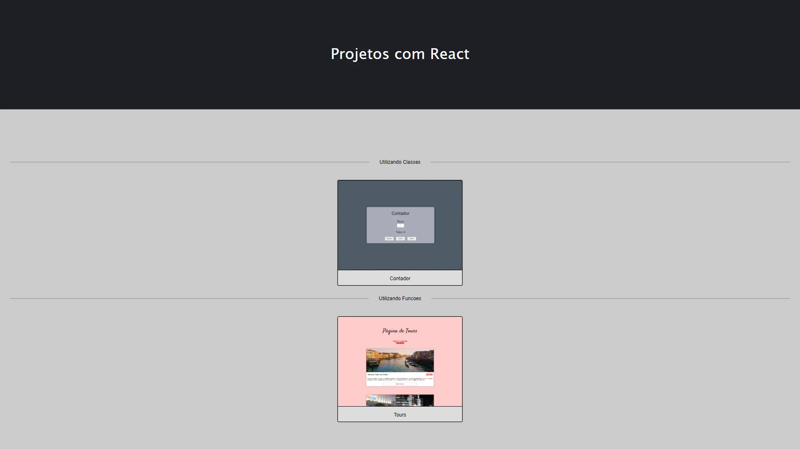
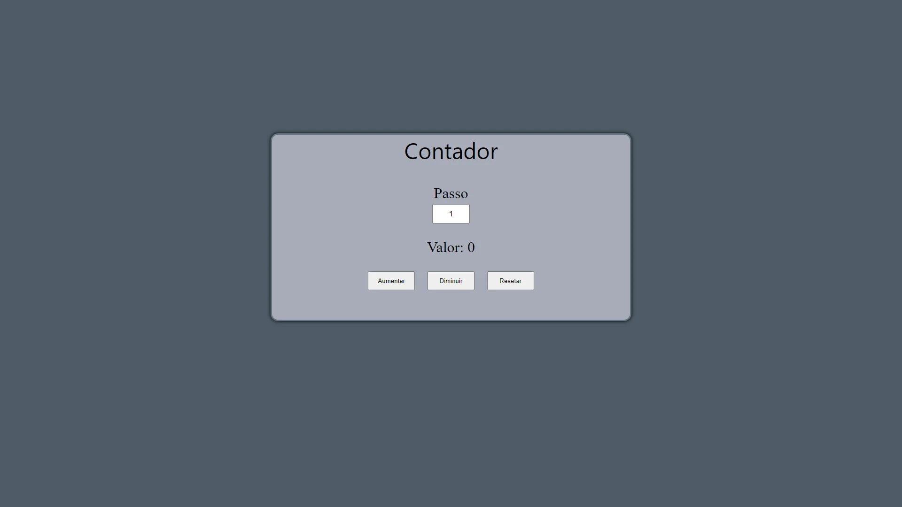
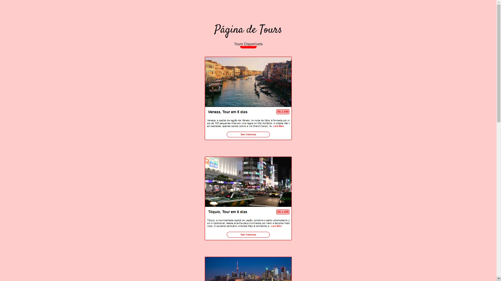

<h1 align="center"> Projetos Utilizando React.JS</h1>
<p align="center">Esse projeto se utiliza de alguns exemplos utilizando o React.JS.</p>

<p align="center">
  
  
  
  
</p>

Tabela de conteúdos
=================
<!--ts-->
   * [Sobre o projeto](#-sobre-o-projeto)
   * [Layout](#-layout)
   * [Como executar o projeto](#-como-executar-o-projeto)
     * [Pré-requisitos](#pré-requisitos)
     * [Rodando a aplicação](#user-content--rodando-a-aplicação)
   * [Tecnologias](#-tecnologias)
   * [Autor](#-autor)
   * [Licença](#user-content--licença)
<!--te-->

## 💻 Sobre o Projeto

Esse projeto engloba alguns exemplos de aplicações, todos utilizando o React.JS. Ele possui uma página principal e a partir dela você navega pelos exemplos criados.

## 🎨 Layout

Página Principal:

<p align="left">
  
</p>

Contador: 

<p align="left">
  
</p>

Tour: 

<p align="left">
  
</p>

## 💿 Como executar o projeto

### Pré-requisitos

Para rodar essa aplicação certifique que você tenha o [Git](https://git-scm.com) e o [Node.js](https://nodejs.org/en/) instalados. Um editor de texto como [VSCode](https://code.visualstudio.com/) caso queira visualizar melhor o código.

### Rodando a aplicação

Utilizando npm

```bash
# Clone este repositório
$ git clone https://github.com/leandrorossi/Projetos-com-React.git

# Acesse a pasta do projeto no terminal/cmd
$ cd Projetos-com-React

# Instale as dependências
$ npm install

# Execute a aplicação em modo de desenvolvimento
$ npm start

# O servidor inciará na porta:3000 - acesse http://localhost:3000
```

Utilizando yarn

```bash
# Clone este repositório
$ git clone https://github.com/leandrorossi/Projetos-com-React.git

# Acesse a pasta do projeto no terminal/cmd
$ cd Projetos-com-React

# Instale as dependências
$ yarn install

# Execute a aplicação em modo de desenvolvimento
$ yarn start

# O servidor inciará na porta:3000 - acesse http://localhost:3000
```

## 🧰 Tecnologias

As seguintes tecnologias foram usadas para a construção do projeto:

- **[HTML](https://developer.mozilla.org/pt-BR/docs/Web/HTML)**
- **[CSS](https://developer.mozilla.org/pt-BR/docs/Web/CSS)**
- **[JavaScript](https://developer.mozilla.org/pt-BR/docs/Web/JavaScript)**
- **[React](https://pt-br.reactjs.org/)**
- **[React-Router](https://reactrouter.com/)**

## 👤 Autor


<b>Leandro U. Rossi</b>

 [](https://www.linkedin.com/in/leandro-rossi-4769ab1a6/)


## 📝 Licença

Esse projeto está sobe a licença [MIT](./LICENSE).
